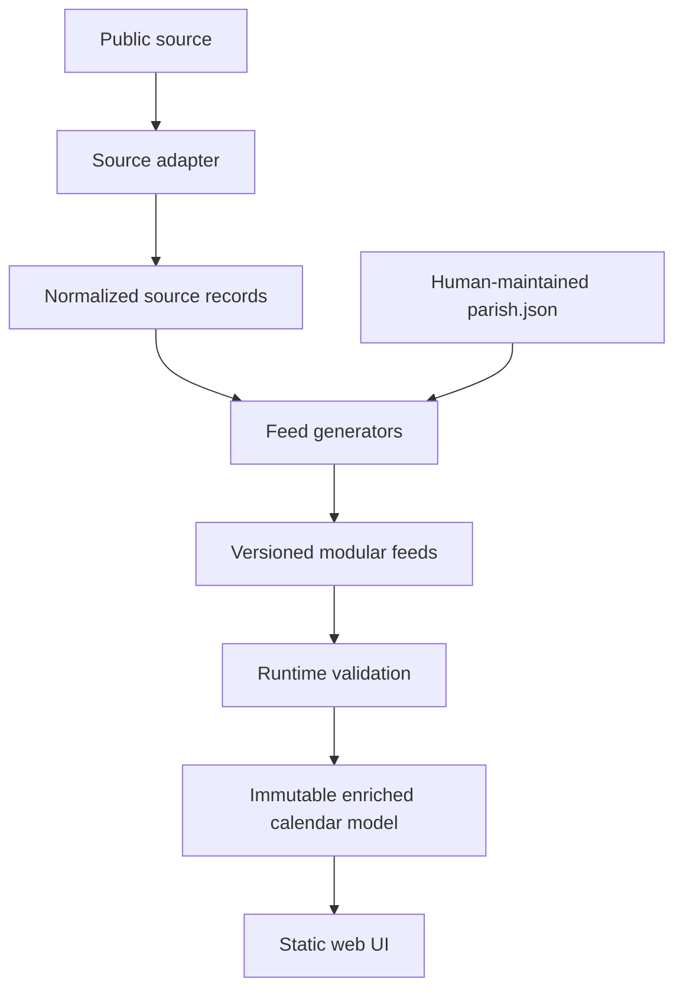

# Architecture

## Goals

GC Pilgrim separates parish identity, worship, community activity, and
liturgical context. Collection mechanisms are implementation details: the web
application consumes the same feeds whether records came from Google Calendar,
a website, a newsletter, or manual entry.

The design supports two parish profiles:

- rich parishes with calendars, presiders, church metadata, and classifications
- sparse parishes with only a name, churches, website, or manually maintained data

## Repository Layout

```text
app/          Static web application
docs/         Architecture, contracts, operations, and migration history
feeds/        Generated public feed artifacts
generators/   Source-independent feed construction
parishes/     Human-maintained parish definitions and ingestion configuration
raw/          Normalized source snapshots used for reproducible offline builds
sources/      Source adapters
tests/        Feed, migration, and runtime tests
validators/   Python feed contract validation
```

The deprecated SPCP iOS project is intentionally excluded. Its code and history
remain in the original `spcp-calendar` repository.

## Data Flow



### Ingestion

Adapters live under `sources/` and use the conceptual interface:

```python
fetch(...)
normalise(...)
```

The Google Calendar adapter currently performs ICS parsing, recurrence
expansion, override handling, classification, church matching, and presider
extraction. The Universalis adapter parses annual Brisbane liturgical calendars.
Manual and newsletter adapters currently define boundaries only; newsletter
extraction is not implemented.

### Generation

`generators/build_all.py` orchestrates the current production build:

1. Load the Surfers Paradise parish definition and config.
2. Read checked-in normalized records or refresh public sources.
3. Generate annual and aggregate liturgical feeds.
4. Split normalized calendar records into services and community events.
5. Validate every feed before atomically writing it.

Services and community records share envelope metadata but use different
collections and record requirements. See [Feed contracts](feeds.md).

### Runtime Assembly

The app first loads `registry.json`, resolves `?parish=<id>` or the registry
default, then fetches parish, services, community, and liturgical feeds in
parallel.

`assembleCalendar()`:

- joins `church_id` to parish church metadata
- joins `liturgical_date` to the date-indexed liturgical feed
- hides cancelled records
- retains modified records
- maps community records into the shared calendar display model
- freezes enriched records and the assembled feed

Downloaded feeds are never modified.

## Published Layout

```text
feeds/v1/
  registry.json
  liturgical.json
  liturgical/
    2026.json
    2027.json
    2028.json
  parishes/
    surfers-paradise/
      parish.json
      services.json
      community.json
```

The built site copies `app/` and `feeds/` into `_site/`.

## Compatibility Boundary

`generators/compat_split.py` converts the former SPCP combined calendar feed
into modular services and community feeds. The combined feed is retained only
at `tests/fixtures/legacy-calendar.json` as a migration oracle. It is not
published or loaded by the application.

## Known Architectural Debt

- `generators/build_all.py` hard-codes `surfers-paradise` and 2026-2028.
- `generators/common.py` contains SPCP-specific church-name mappings.
- `config.json` records source strategies but does not yet dispatch adapters.
- Generated records are currently always `active`; correction merging is not implemented.
- The community feed is structurally supported but currently empty.
- There is no scheduled source-refresh workflow; CI performs reproducible offline builds.

These are onboarding and automation limitations, not feed-contract changes.
